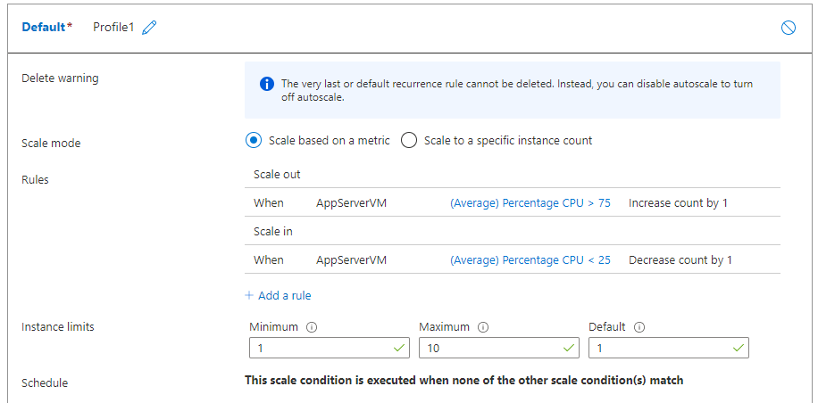
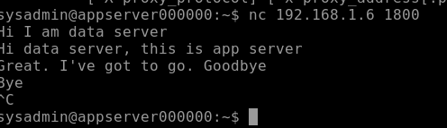
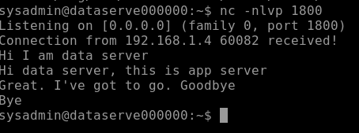

# Week 8
- May 4th 

After gaining enough confidence from my work in the last week, have analyzed the logical network diagram developed by our team and started adding the resources to the resource group. I created scale sets and installed some important tools on the servers. I initially set the scale sets on different private networks. So, the servers of one type are unable to see the servers of other type despite being in the same network. To get around that issue, I moved all the scale sets to same subnet. Then I tested the automatic scale-up and scale-down features, effectiveness of firewall rules (set through NSGs), interactivity between those servers (by using netcat), etc. They are working as we expect them to. Some of the screenshots I took when developing the design can be seen here

Scaling settings on Azure

The data transfer between app server and data serveris working.

A sample firewall rules set through NSG

- May 8th

Today I worked on interim report. I have added all the work that was done on the proof concept. I took more screenshots from Azure cloud and added them to the report. I also revised the product reviews section I wrote for the project as well. After that, I worked with the teammates to proofread the report and make corrections to the report. 

I finally figured out why the servers are not able to see each other. I accidentally hosted CDN server on Australia Central and the remaining ones are in Australia Southeast. I was trying to connect from CDN instance to app server instance. They are unable find each other because even though both are in the 192.168.10.0/24 subnet, they are not in the same network and there is no route configured between these two servers. So, it didn’t work.  
